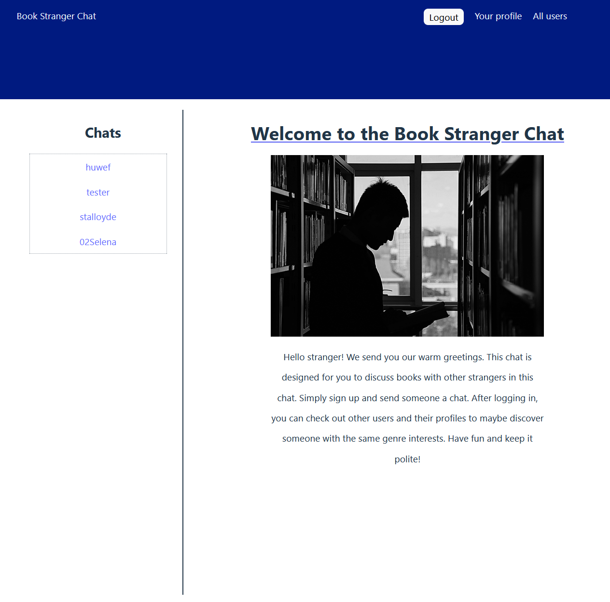

# A messaging app

This project is build using a React frontend and backend using Express, NodeJS + MongoDB. User authentication is handled via a local strategy with Passport.js. JSON Web Tokens are used to protect routes within the application. Messages are not instant since the project uses a REST API backend. Users need to manually make a request to check for new messages.

## The Odin Project: Lesson Messaging App

The project is build according to the specification of the [Messaging App lesson](https://www.theodinproject.com/lessons/nodejs-messaging-app)

## Live website

The app is meant for people who want to discuss books with other people online.

Simply sign up and find users you like to engage with based on their profile.

Access the [Messaging App](https://messaging-app-odin-frontend.netlify.app/)

## Run locally

*In order to run project locally NodeJS + Git needs to installed on your system*

Follow these steps on Mac/Linux/WSL to run the project locally:

1. Open a terminal and go to a directory you want the repository to be in
2. Select Code in the Github project page and copy the SSH URL
3. git clone *your SSH URL*
4. 'cd' into the repository you just cloned
5. 'cd' into messaging-app-backend & run 'npm install'
6. Run 'npm run serverStart' in messaging-app-backend directory
7. Open another terminal
8. 'cd' into messaging-app-frontend & run 'npm install'
9. Run 'npm run dev' in messaging-app-frontend
10. Open the link that is shown in the terminal in your browser
